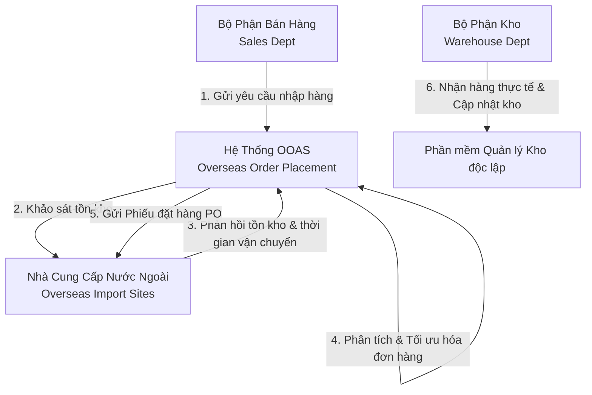
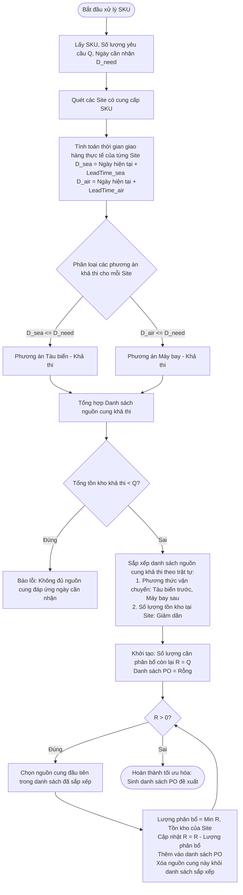

# TÀI LIỆU TỔNG QUAN HỆ THỐNG (SYSTEM OVERVIEW)
## HỆ THỐNG TỰ ĐỘNG HÓA ĐẶT HÀNG QUỐC TẾ (OVERSEAS ORDER AUTOMATION SYSTEM - OOAS)

Hệ thống OOAS được thiết kế nhằm giúp **Bộ phận đặt hàng quốc tế (Overseas Order Placement Dept)** tự động hóa quy trình đối chiếu cung-cầu, tính toán thời gian vận chuyển, và tối ưu hóa việc phân chia đơn hàng từ các nhà cung cấp nước ngoài (**Overseas Import Sites**), ưu tiên tối đa việc vận chuyển bằng đường biển và giảm thiểu đầu mối cung cấp để tối ưu chi phí.

---

## 1. MỤC TIÊU & PHẠM VI HỆ THỐNG
* **Tự động hóa quy trình tiếp nhận:** Loại bỏ các thao tác thủ công khi nhận yêu cầu từ Bộ phận bán hàng (Sales Dept).
* **Khảo sát tồn kho thông minh:** Tự động kết nối, truy vấn dữ liệu tồn kho từ các Site và lưu trữ phục vụ việc đối chiếu cung - cầu.
* **Quản lý vận chuyển linh hoạt:** Cập nhật thời gian vận chuyển (đường biển và đường hàng không) từ các Site liên tục.
* **Thuật toán chia đơn hàng tối ưu (Core Logic):** Tự động tính toán phương án gom hàng/chia đơn dựa trên 3 tiêu chí cốt lõi:
  1. Ưu tiên **Đường biển (Sea)** hơn **Đường hàng không (Air)** để tiết kiệm chi phí.
  2. Ưu tiên Site có **tồn kho lớn nhất** để đảm bảo khả năng cung ứng.
  3. Chọn **ít Site nhất có thể** để giảm thiểu đầu mối liên hệ và chi phí thủ tục hải quan.
* **Chốt đơn tự động:** Tạo và xuất các Phiếu đặt hàng chính thức (Purchase Orders) gửi tới các Site được lựa chọn.

---

## 2. CÁC TÁC NHÂN THAM GIA (SYSTEM ACTORS)

* **Bộ phận bán hàng (Sales Dept):** Tạo và gửi danh sách các mặt hàng cần nhập, bao gồm: Mã hàng (SKU), Số lượng (Quantity), và Ngày cần nhận mong muốn (Expected Date).
* **Bộ phận đặt hàng quốc tế (Overseas Order Placement Dept):** Sử dụng hệ thống OOAS để điều phối, chạy thuật toán tối ưu, chốt phương án và gửi đơn hàng.
* **Các nhà cung cấp nước ngoài (Overseas Import Sites):** Cung cấp thông tin tồn kho thời thực và thời gian vận chuyển (Sea/Air Lead Times). Nhận phiếu đặt hàng (PO) từ hệ thống.
* **Bộ phận quản lý kho (Warehouse Dept):** Tiếp nhận hàng thực tế khi về cảng/kho và xử lý trên hệ thống ERP/WMS độc lập (ngoài phạm vi trực tiếp của hệ thống OOAS này, nhưng nhận dữ liệu đối chiếu).

---

## 3. QUY TRÌNH HOẠT ĐỘNG CỐT LÕI (CORE WORKFLOW)

### Quy trình 5 bước tự động hóa:
1. **Tiếp nhận yêu cầu nhập hàng:**
   * Hệ thống tiếp nhận tệp danh sách yêu cầu từ Sales Dept dưới dạng Form nhập liệu trực quan hoặc File Excel/JSON.
   * Yêu cầu chứa các trường: `Mã hàng (SKU)`, `Số lượng cần (Requested Qty)`, `Ngày cần nhận (Expected Date)`.
2. **Khảo sát tồn kho tự động:**
   * Hệ thống quét danh sách các Site có cung cấp mặt hàng tương ứng.
   * Gửi yêu cầu truy vấn tồn kho trực tiếp tới các Site (hoặc đọc từ cổng API/File cập nhật của Site).
   * Ghi nhận và lưu thông tin phản hồi vào **Tệp thông tin kho (Inventory Database / File)**.
3. **Quản lý vận chuyển:**
   * Hệ thống duy trì và liên tục cập nhật **Tệp thông tin site (Site Logistics Database)** chứa thông tin:
     * Thời gian giao hàng bằng Tàu biển (Sea Lead Time - ngày).
     * Thời gian giao hàng bằng Máy bay (Air Lead Time - ngày).
4. **Quyết định & Tối ưu hóa đặt hàng (Thuật toán Core):**
   * Đối chiếu ngày cần nhận của Sales với thời gian vận chuyển của từng Site để lọc ra các phương thức vận chuyển khả thi (Khả thi khi: `Ngày hiện tại + Thời gian vận chuyển <= Ngày cần nhận`).
   * Áp dụng thuật toán chia đơn hàng (chi tiết tại Mục 4).
   * Hỗ trợ gom hàng từ nhiều Site nếu không có Site nào đủ số lượng.
   * Phát cảnh báo lỗi/thiếu hàng nếu tổng tồn kho khả thi của tất cả các Site vẫn nhỏ hơn số lượng yêu cầu.
5. **Chốt đơn (Purchase Order Generation):**
   * Tự động sinh mã Phiếu đặt hàng chính thức (PO).
   * Xuất file PO gồm: Mã hàng, Số lượng, Phương thức vận chuyển (Sea/Air), Site tiếp nhận.
   * Gửi PO đến các Site đã được lựa chọn qua email hoặc API tích hợp.

---

## 4. THUẬT TOÁN TỐI ƯU HÓA PHÂN CHIA ĐƠN HÀNG (OPTIMIZATION ALGORITHM)

Để giải quyết bài toán đa mục tiêu: **Ưu tiên đường biển > Tồn kho lớn nhất > Số lượng Site ít nhất**, hệ thống áp dụng thuật toán Greedy kết hợp phân nhóm ưu tiên như sau:

### Các bước xử lý thuật toán cho mỗi mặt hàng (SKU) cần nhập:

### Chi tiết bộ lọc và sắp xếp (Sorting Criteria):
Mỗi nguồn cung khả thi là một bộ dữ liệu `Candidate(Site, Method, AvailableStock)`.
Danh sách các `Candidate` này được sắp xếp theo độ ưu tiên giảm dần:
1. **Ưu tiên 1 (Phương thức vận chuyển):** `Method == Sea` xếp trước `Method == Air`.
2. **Ưu tiên 2 (Tồn kho tại Site):** `AvailableStock` xếp giảm dần (Site có kho lớn hơn xếp trước).

### Tại sao thuật toán này tối ưu cả 3 tiêu chí?
* **Ưu tiên 1** đảm bảo hệ thống luôn lấy hết toàn bộ hàng đi bằng đường biển (Sea) khả thi trước khi phải dùng đến đường hàng không (Air), giúp **tối ưu hóa chi phí vận chuyển tối đa**.
* **Ưu tiên 2** đảm bảo chọn Site có tồn kho lớn nhất trước.
* Việc ưu tiên chọn Site có tồn kho lớn nhất một cách tham lam (Greedy) cũng đồng thời **giảm thiểu số lượng Site cần chọn (ít đầu mối nhất)** vì các Site lớn sẽ nhanh chóng lấp đầy số lượng yêu cầu $Q$, hạn chế việc phải chia nhỏ đơn hàng ra nhiều Site nhỏ.

---

## 5. THIẾT KẾ GIAO DIỆN & TRẢI NGHIỆM NGƯỜI DÙNG (UX/UI MOCKUP IDEAS)

Để mang lại trải nghiệm làm việc hiện đại, chuyên nghiệp và hiệu quả, ứng dụng sẽ có giao diện Web-based cao cấp với các module chính:

1. **Bảng điều khiển Tổng quan (Dashboard):**
   * Chỉ số thống kê nhanh: Số yêu cầu đang xử lý, tỷ lệ đơn hàng đi đường biển (Sea ratio), số lượng PO đã xuất trong tháng.
   * Biểu đồ trực quan hóa thời gian vận chuyển của các Site và mức tồn kho hiện tại.
2. **Quản lý Yêu cầu Nhập hàng (Order Requests Management):**
   * Giao diện nhận danh sách hàng từ Sales. Cho phép nhập thủ công hoặc Import file Excel siêu tốc.
   * Trạng thái xử lý trực quan (Chờ xử lý, Đang tối ưu, Đã chốt PO, Lỗi không đủ hàng).
3. **Bộ xử lý & Tối ưu hóa Đơn hàng (Optimization Engine Screen):**
   * Cho phép chọn danh sách hàng cần xử lý và nhấn nút **"Chạy Thuật Toán Tối Ưu"**.
   * Hệ thống hiển thị trực quan các phương án đề xuất phân chia đơn hàng dưới dạng biểu đồ thanh (Bar Chart) hoặc bảng phân bổ chi tiết, làm nổi bật phương thức vận chuyển (Sea/Air) và tỉ lệ gom hàng.
   * Cho phép nhân viên Đặt hàng quốc tế phê duyệt nhanh hoặc điều chỉnh thủ công nếu cần trước khi xuất PO.
4. **Quản lý Tệp Thông tin Site & Kho (Site & Stock Registry):**
   * Quản lý danh sách các Site nước ngoài, thông số Lead Time (Sea/Air) và mức tồn kho hiện tại của từng SKU tại mỗi Site.
   * Giao diện cập nhật nhanh bằng tay hoặc nút đồng bộ tự động dữ liệu từ các Site.

---

## 6. KIẾN TRÚC KỸ THUẬT ĐỀ XUẤT (PROPOSED TECH STACK)

Để đảm bảo tốc độ phản hồi nhanh, giao diện cực kỳ mượt mà, đẹp mắt và dễ vận hành, hệ thống được đề xuất xây dựng bằng:
* **Frontend:** React.js (Vite) mang lại sự mượt mà vượt trội, tương tác thời gian thực.
* **Styling & UI Components:** Vanilla CSS được thiết kế tỉ mỉ, sử dụng bảng màu HSL hiện đại (Dark/Light mode hài hòa), font chữ cao cấp (Inter/Outfit), bo góc mềm mại, kết hợp hiệu ứng Glassmorphism và micro-animations khi rê chuột.
* **Data Storage:** Lưu trữ dữ liệu cấu hình Site, tồn kho, yêu cầu nhập hàng và PO trong **PostgreSQL**, truy cập thông qua **Spring Data JPA** ở tầng backend.
* **Visual Library:** Sử dụng Lucide React cho hệ thống icon chuyên nghiệp, Recharts cho biểu đồ trực quan hóa số liệu tồn kho/vận chuyển.
