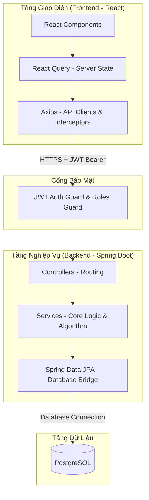

# TÀI LIỆU CÔNG NGHỆ & ĐỊNH HƯỚNG KỸ THUẬT (TECHNICAL ARCHITECTURE & TECHNOLOGIES SPECIFICATION)
## HỆ THỐNG TỰ ĐỘNG HÓA ĐẶT HÀNG QUỐC TẾ (OVERSEAS ORDER AUTOMATION SYSTEM - OOAS)

Tài liệu này đặc tả chi tiết các giải pháp công nghệ, kiến trúc hệ thống và quy trình phát triển cho hệ thống OOAS, làm cơ sở kỹ thuật chung cho toàn bộ đội ngũ phát triển.

---

## 1. CÔNG NGHỆ CỐT LÕI (CORE TECH STACK)

Hệ thống được xây dựng trên các nền tảng công nghệ mạnh mẽ, hướng tới sự ổn định, hiệu năng và khả năng bảo trì lâu dài:

*   **Backend:** **Java Spring Boot** kết hợp với **Spring Data JPA** và cơ chế xác thực **JWT (JSON Web Token)**.
*   **Frontend:** **React** sử dụng ngôn ngữ **TypeScript**, quản lý Server State bằng **React Query (TanStack Query)**.
*   **Cơ sở dữ liệu:** **PostgreSQL** phục vụ lưu trữ dữ liệu quan hệ với tính toàn vẹn cao.
*   **Công cụ phát triển (Tooling):** Quản lý mã nguồn bằng **Git**, kiểm thử và đặc tả API bằng **Postman**.

---

## 2. KIẾN TRÚC KỸ THUẬT HỆ THỐNG (SYSTEM ARCHITECTURE)

Hệ thống áp dụng kiến trúc **Client-Server** tách biệt hoàn toàn giữa giao diện người dùng và máy chủ dịch vụ, kết nối và trao đổi dữ liệu thông qua **RESTful API** bảo mật.

### Nguyên lý tương tác giữa các tầng:
1.  **Frontend** gửi các yêu cầu dữ liệu qua giao thức HTTPS. Token xác thực (JWT) được đính kèm tự động trong header của mỗi yêu cầu.
2.  **Cổng bảo mật** tại Backend chặn các yêu cầu, giải mã JWT để xác thực danh tính người dùng và đối chiếu vai trò (Role) của họ trước khi cho phép đi tiếp.
3.  **Spring MVC Controller** định tuyến yêu cầu đến **Service** tương ứng để thực hiện logic nghiệp vụ (ví dụ: chạy thuật toán tối ưu đơn hàng).
4.  **Spring Data JPA / Hibernate** biên dịch các yêu cầu dữ liệu thành các câu lệnh SQL tối ưu và gửi đến cơ sở dữ liệu **PostgreSQL** để truy xuất hoặc cập nhật.

---

## 3. THIẾT KẾ & GIẢI PHÁP BACKEND (BACKEND DESIGN & SOLUTIONS)

### 3.1. Spring Boot & Spring Data JPA Integration
Backend sử dụng framework Spring Boot theo mô hình hướng đối tượng (OOP), phân lớp rõ ràng theo Controller - Service - Repository.
*   **Spring Data JPA** đóng vai trò là cầu nối dữ liệu, ánh xạ các Entity Java sang bảng PostgreSQL thông qua Hibernate, giảm rủi ro sai lệch trường thông tin trong quá trình phát triển.
*   Mỗi thực thể nghiệp vụ (SKU, Site, Order Request, Purchase Order) được tách riêng thành các package Controller, Service, DTO, Repository đảm bảo tính cô lập và dễ viết unit test.

### 3.2. Cơ chế Xác thực & Phân quyền (Authentication & Authorization)
*   **Xác thực (Authentication):** Sử dụng chiến lược xác thực phi trạng thái (Stateless Authentication) dựa trên **JWT (JSON Web Token)**. Khi đăng nhập thành công, Server phát hành mã Access Token có thời hạn sử dụng xác định.
*   **Phân quyền (Authorization):** Sử dụng **Spring Security Method Security** để kiểm soát truy cập ở mức Endpoint dựa trên vai trò người dùng (Roles). Các nhóm vai trò nghiệp vụ được cấu hình bao gồm:
    *   `ADMIN`: Quản trị hệ thống, phê duyệt và phân quyền tài khoản nhân viên.
    *   `SALES`: Tạo và quản lý yêu cầu nhập hàng gửi từ bộ phận bán hàng.
    *   `OVERSEAS_ORDER`: Chạy thuật toán tối ưu, chốt PO và gửi đơn cho Site nước ngoài.
    *   `WAREHOUSE`: Kiểm đếm thực tế và xác nhận nhập kho đối chiếu.
    *   `SUPPLIER`: Xem thông tin PO và cập nhật tiến độ giao hàng từ Site.

### 3.3. Thiết kế Thuật toán Phân chia Đơn hàng Tối ưu (Core Optimization Logic)
Bộ máy tối ưu hóa đơn hàng được triển khai hoàn toàn ở tầng Service của Backend để xử lý bài toán gom hàng đa mục tiêu:
1.  **Bộ lọc Khả thi (Feasibility Filter):** Dựa trên ngày cần hàng mong muốn của Sales, thuật toán đối chiếu với thời gian vận chuyển của từng Site (Sea Lead Time / Air Lead Time) để lọc ra các phương án vận chuyển kịp tiến độ.
2.  **Trật tự Ưu tiên (Priority Sorting):** Sắp xếp danh sách nguồn cung khả thi theo 2 tiêu chí cốt lõi:
    *   *Tiêu chí 1:* Ưu tiên đường tàu biển (SEA) trước đường bay (AIR) để tối ưu chi phí.
    *   *Tiêu chí 2:* Ưu tiên các Site có tồn kho lớn nhất trước để gom đơn, giảm tối đa số lượng Site cần đặt (giảm thiểu thủ tục hải quan và chi phí vận hành).
3.  **Thuật toán Gom đơn (Greedy Allocation):** Tiến hành phân bổ số lượng hàng cần đặt một cách tham lam (Greedy) vào các Site đã sắp xếp. Phát cảnh báo lỗi nếu tổng lượng tồn kho khả thi trên toàn hệ thống không đáp ứng đủ yêu cầu của Sales.

---

## 4. THIẾT KẾ & GIẢI PHÁP FRONTEND (FRONTEND DESIGN & SOLUTIONS)

### 4.1. React & TypeScript
*   Ứng dụng Frontend được thiết kế theo hướng Component-driven (phát triển các thành phần UI độc lập, có khả năng tái sử dụng cao).
*   **TypeScript** được áp dụng nghiêm ngặt để đảm bảo Type-safety từ DTOs (Data Transfer Objects) nhận từ API cho đến các thuộc tính (Props) của Component.

### 4.2. Quản lý Server State (React Query / TanStack Query)
Hệ thống loại bỏ hoàn toàn việc lưu trữ dữ liệu từ API vào Client Global State (Redux/Context) bằng cách sử dụng **React Query**:
*   **Đồng bộ tự động (Auto-Sync & Cache):** Dữ liệu danh sách yêu cầu, thông tin site, hay tồn kho sẽ được cache ở client và tự động tải lại dưới nền khi người dùng chuyển tab hoặc khi dữ liệu bị cũ (stale).
*   **Trạng thái Mutation (Mutation Tracking):** Quản lý nhất quán các trạng thái bất đồng bộ (Loading, Success, Error) khi thực hiện các hành động gửi yêu cầu, chạy thuật toán tối ưu, chốt đơn hàng PO, hay xác nhận nhập kho.

### 4.3. Bảo mật & Quản lý Mã xác thực (Token Management)
*   JWT Access Token được lưu trữ an toàn trong bộ nhớ Client.
*   Thiết lập **Axios Interceptors** để tự động đính kèm Bearer Token vào tiêu đề các cuộc gọi API.
*   Xử lý lỗi tập trung: Nếu nhận phản hồi HTTP 401 (Unauthorized/Token hết hạn), ứng dụng sẽ tự động xóa token và chuyển hướng người dùng về màn hình đăng nhập.
*   Cấu hình **Private Routes** để ngăn chặn người dùng chưa xác thực hoặc không đúng vai trò nghiệp vụ truy cập trái phép vào các màn hình chức năng qua URL.

### 4.4. Giải pháp Giao diện & Trải nghiệm (Premium Styling & UX)
*   **Vanilla CSS** được viết độc lập bằng các CSS Modules hoặc file CSS cấu trúc rõ ràng để kiểm soát hoàn toàn giao diện mà không phụ thuộc framework bên thứ ba.
*   **Design System Tokens:** Sử dụng hệ biến CSS (CSS Variables) xây dựng trên bảng màu **HSL** giúp dễ dàng tùy biến hoặc chuyển đổi giao diện sáng/tối (Dark/Light mode).
*   **Aesthetics:** Ứng dụng các phong cách thiết kế hiện đại như hiệu ứng kính mờ (Glassmorphic panels), độ bóng sâu tự nhiên (Smooth shadows), bo góc mềm mại, cùng các hiệu ứng micro-animations mượt mà khi rê chuột (Hover) hay nhấn nút để tăng tương tác trải nghiệm người dùng.

---

## 5. QUY TRÌNH PHÁT TRIỂN & CÔNG CỤ (DEVELOPMENT WORKFLOW & TOOLING)

### 5.1. Mô hình Phân nhánh Git (Git Flow)
Quy trình phát triển nhóm áp dụng mô hình Git Flow chặt chẽ để tránh xung đột mã nguồn:
*   Nhánh `main`: Chỉ chứa mã nguồn ổn định nhất phục vụ môi trường chạy chính thức (Production).
*   Nhánh `develop`: Nhánh tập hợp các tính năng đã hoàn thiện và được kiểm thử ổn định.
*   Các nhánh `feature/*`: Tách riêng cho từng Use Cases hoặc chức năng cụ thể của từng thành viên (ví dụ: `feature/UC1-order-request`). Sau khi hoàn thành, tạo Pull Request (PR) trỏ về `develop` để được review code trước khi tích hợp.

### 5.2. Công cụ Đặc tả & Kiểm thử API (Postman)
*   **Tài liệu hóa API:** Sử dụng Postman để lập danh mục toàn bộ các Endpoint của hệ thống (Authentication, Order Requests, Optimization Engine, Purchase Orders, Warehousing).
*   **Pre-request & Test Scripts:** Tận dụng tính năng viết mã kiểm thử tự động của Postman để kiểm tra tính đúng đắn của dữ liệu phản hồi (Status Code, JSON Schema) và tự động trích xuất JWT Token lưu trữ vào biến môi trường phục vụ cho các chuỗi API tiếp theo.

### 5.3. Quản lý Database Migrations
*   Mọi thay đổi cấu trúc bảng cơ sở dữ liệu được quản lý qua **Flyway SQL migrations** trong `src/main/resources/db/migration`.
*   Sử dụng **Flyway** để tạo và chạy các tệp dịch chuyển cấu trúc cơ sở dữ liệu đồng bộ, giúp tất cả các thành viên trong dự án dễ dàng đồng bộ cấu trúc database trên máy cục bộ khi ứng dụng Spring Boot khởi động.
