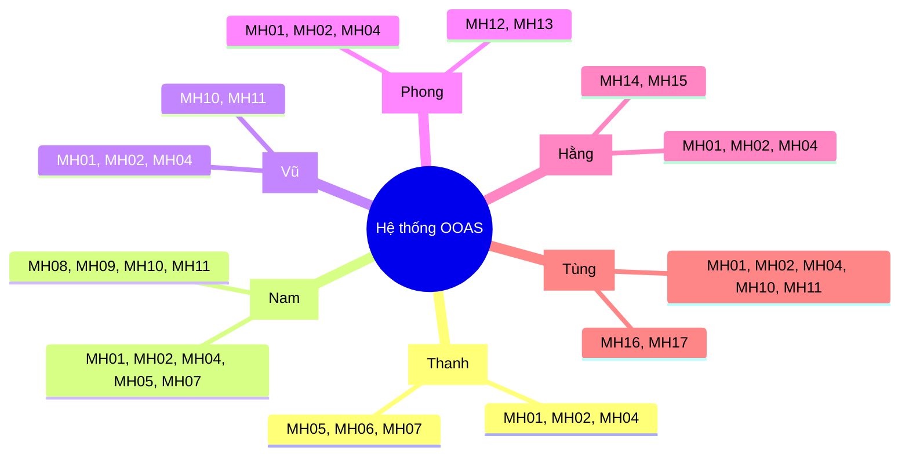

# DANH SÁCH USE CASES & MA TRẬN PHÂN CHIA MÀN HÌNH (MH)

## HỆ THỐNG TỰ ĐỘNG HÓA ĐẶT HÀNG QUỐC TẾ (OOAS)

Tài liệu này đặc tả danh sách các **Use Cases (UC)**, phân công trách nhiệm thành viên thực hiện và chi tiết hóa danh sách **Màn hình (MH)**. Đồng thời, tài liệu cung cấp **Ma trận Phân chia Màn hình** nhằm làm rõ các màn hình dùng chung giữa các chức năng và các thành viên.

---

## 1. PHÂN CHIA NHIỆM VỤ THEO USE CASES (UC)

### Chi tiết các Use Cases:

- **UC1 – Quản lý yêu cầu nhập hàng (Phụ trách: Thanh)**
  - _Mô tả:_ Tiếp nhận, khởi tạo, chỉnh sửa các yêu cầu cần nhập hàng từ phía Bộ phận bán hàng (Sales Dept).
  - _Danh sách màn hình:_ MH01, MH02, MH04, MH05, MH06, MH07.

- **UC2 – Xử lý yêu cầu nhập hàng (Phụ trách: Nam)**
  - _Mô tả:_ Lọc site, khảo sát tồn kho, áp dụng thuật toán tối ưu hóa phân chia đơn hàng và sinh/gửi đơn hàng chính thức.
  - _Danh sách màn hình:_ MH01, MH02, MH04, MH05, MH07, MH08, MH09, MH10, MH11.

- **UC3 – Quản lý đơn hàng (Phụ trách: Vũ)**
  - _Mô tả:_ Quản lý toàn bộ danh sách đơn đặt hàng (PO) đã chốt, theo dõi tiến độ tổng quan, chỉnh sửa thông tin đơn khi cần.
  - _Danh sách màn hình:_ MH01, MH02, MH04, MH10, MH11.

- **UC4 – Quản lý thông tin Site (Phụ trách: Phong)**
  - _Mô tả:_ Quản lý các nhà cung cấp nước ngoài, thiết lập và cập nhật liên tục thông số Logistics (Lead Time biển/bay) và thông tin liên hệ.
  - _Danh sách màn hình:_ MH01, MH02, MH04, MH12, MH13.

- **UC5 – Nhập kho và cập nhật tồn kho (Phụ trách: Hằng)**
  - _Mô tả:_ Tiếp nhận hàng về, đối chiếu danh sách thực nhập với đơn đặt hàng (PO) và xác nhận nhập kho trên hệ thống.
  - _Danh sách màn hình:_ MH01, MH02, MH04, MH14, MH15.

- **UC6 – Theo dõi trạng thái vận chuyển (Phụ trách: Tùng)**
  - _Mô tả:_ Giám sát lộ trình của đơn hàng đang trên đường vận chuyển (đang đi tàu/bay), cập nhật tọa độ hoặc tình trạng vận đơn.
  - _Danh sách màn hình:_ MH01, MH02, MH04, MH10, MH11, MH16, MH17.

---

## 2. DANH SÁCH CHI TIẾT MÀN HÌNH (SCREEN LIST)

| Mã MH    | Tên Màn Hình / Chức Năng                  | Mô Tả Chi Tiết                                                                                              |
| :------- | :---------------------------------------- | :---------------------------------------------------------------------------------------------------------- |
| **MH01** | Đăng nhập                                 | Cho phép các nhân viên thuộc các bộ phận khác nhau đăng nhập vào hệ thống theo quyền hạn của mình.          |
| **MH02** | Đăng ký tài khoản                         | Đăng ký tài khoản mới cho nhân viên.                                                                        |
| **MH03** | Danh sách tài khoản & phân quyền          | Dành riêng cho **Admin** để cấu hình phân quyền vai trò (Sales, Đặt hàng QT, Kho, Supplier...).             |
| **MH04** | Trang chủ / Menu chính                    | Bảng điều khiển trung tâm (Dashboard) hiển thị lối tắt chức năng tùy theo quyền hạn truy cập của tài khoản. |
| **MH05** | Danh sách yêu cầu nhập hàng               | Hiển thị toàn bộ các yêu cầu nhập hàng từ Sales Dept gửi lên với trạng thái tương ứng.                      |
| **MH06** | Tạo / Sửa yêu cầu nhập hàng               | Giao diện cho phép điền SKU, Số lượng, Ngày mong muốn (cho phép import hàng loạt từ Excel).                 |
| **MH07** | Chi tiết yêu cầu nhập hàng                | Xem thông tin chi tiết của một yêu cầu nhập hàng cụ thể (danh sách SKU, số lượng chi tiết).                 |
| **MH08** | Kết quả truy vấn tồn kho                  | Hiển thị bảng tổng hợp tồn kho của các SKU tại các Site sau khi hệ thống khảo sát tự động.                  |
| **MH09** | Xác nhận & gửi đơn đặt hàng               | Màn hình chạy **Thuật toán Tối ưu**, hiển thị phương án phân bổ đề xuất và nút nhấn chốt gửi PO.            |
| **MH10** | Danh sách đơn hàng                        | Quản lý tập trung các đơn hàng (PO) đã được tạo ra trong hệ thống.                                          |
| **MH11** | Chi tiết / Sửa đơn hàng                   | Xem nội dung chi tiết của một PO (Site cung cấp, Số lượng từng SKU, Phương thức vận chuyển, Tổng tiền).     |
| **MH12** | Danh sách site                            | Quản lý danh sách các nhà cung cấp nước ngoài đang liên kết với hệ thống.                                   |
| **MH13** | Chi tiết / Quản lý site                   | Xem và cập nhật các tham số giao hàng (Sea Lead Time, Air Lead Time) và danh mục hàng hóa của Site.         |
| **MH14** | Danh sách đơn hàng cần nhập kho           | Lọc ra các đơn đặt hàng có trạng thái "Đang vận chuyển" hoặc "Đã tới cảng" để chuẩn bị nhập kho.            |
| **MH15** | Kiểm tra & xác nhận nhập kho              | Giao diện đối chiếu số lượng thực tế nhận được so với đơn hàng gốc để bấm duyệt cập nhật kho.               |
| **MH16** | Danh sách đơn hàng đang vận chuyển        | Hiển thị các đơn hàng đang trên đường đi (phân biệt đường biển/đường hàng không).                           |
| **MH17** | Chi tiết & cập nhật trạng thái vận chuyển | Cập nhật các mốc thời gian giao hàng thực tế (ETD, ETA, hải quan, đang giao hàng chặng cuối).               |

---

