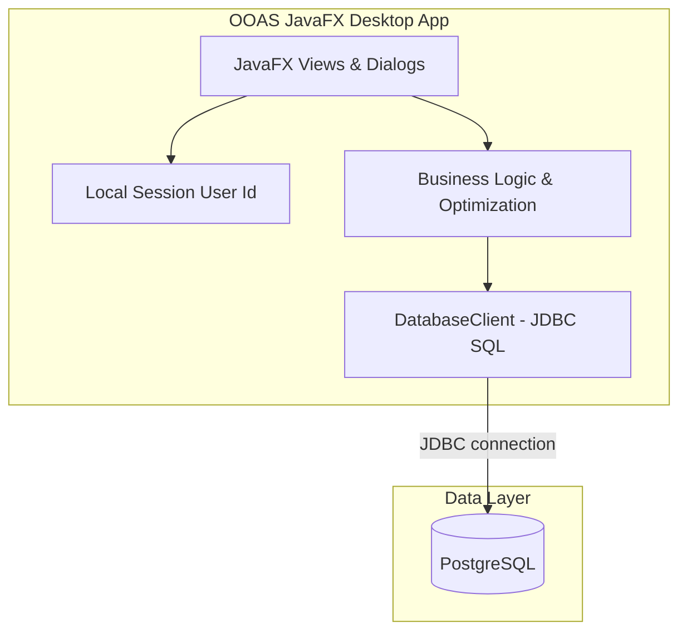

# TÀI LIỆU CÔNG NGHỆ & ĐỊNH HƯỚNG KỸ THUẬT
## HỆ THỐNG TỰ ĐỘNG HÓA ĐẶT HÀNG QUỐC TẾ (OOAS)

Tài liệu này mô tả kiến trúc hiện tại của OOAS sau khi chuyển sang **JavaFX desktop app nối trực tiếp PostgreSQL qua JDBC**. Luồng chạy chính không dùng web frontend, không gọi backend REST, không dùng ORM.

---

## 1. Công nghệ cốt lõi

*   **Desktop UI:** JavaFX chạy bằng Java 21.
*   **Database:** PostgreSQL.
*   **Data access:** JDBC trực tiếp qua `DriverManager`, `Connection`, `PreparedStatement`, `ResultSet` và transaction SQL thủ công.
*   **Dependency tối thiểu:** JavaFX runtime, PostgreSQL JDBC driver và BCrypt verifier để đọc đúng password seed hiện có.
*   **Tooling:** Maven Wrapper, Docker Compose cho PostgreSQL, Git.

---

## 2. Kiến trúc hệ thống

Ứng dụng chạy theo mô hình desktop nội bộ: người dùng mở cửa sổ JavaFX, app kết nối thẳng tới PostgreSQL bằng JDBC URL và tài khoản DB được nhập ở màn hình đăng nhập hoặc lấy từ `.env`.

Nguyên lý tương tác:

1.  JavaFX nhận thao tác người dùng qua các màn hình nghiệp vụ.
2.  `DatabaseClient` mở kết nối JDBC, chạy SQL bằng prepared statement và trả dữ liệu về UI.
3.  Các thao tác ghi như tạo yêu cầu, tạo PO, nhập kho và cập nhật tracking chạy trong transaction để giữ dữ liệu nhất quán.
4.  Không có HTTP server, không có JWT bearer token, không có REST endpoint trong luồng chạy desktop.

---

## 3. Data access & nghiệp vụ

### 3.1. JDBC trực tiếp

*   Tất cả truy vấn nằm trong `src/main/java/com/ooas/repository`.
*   Query dùng `PreparedStatement` để truyền tham số, hạn chế lỗi SQL injection.
*   Transaction được quản lý thủ công bằng `setAutoCommit(false)`, `commit()` và `rollback()`.
*   Không dùng Spring Data JPA, Hibernate, Jackson hay Java `HttpClient` trong app desktop.

### 3.2. Xác thực & phân quyền

*   Đăng nhập đọc trực tiếp bảng `users`.
*   Password seed hiện đang là BCrypt hash, nên app dùng BCrypt verifier để kiểm tra mật khẩu đúng với dữ liệu đã seed.
*   Sau khi đăng nhập, app lưu `sessionUserId` trong Java Preferences để khôi phục phiên cục bộ.
*   Phân quyền kiểm tra role trong DB: `ADMIN`, `SALES`, `OVERSEAS_ORDER`, `WAREHOUSE`, `SUPPLIER`.

### 3.3. Thuật toán tối ưu đơn hàng

Thuật toán nằm trong `DatabaseClient` và chạy trực tiếp trên dữ liệu PostgreSQL:

1.  Lấy danh sách SKU cần đặt từ `order_requests` và `order_request_items`.
2.  Đối chiếu tồn kho từ `site_inventories` cùng lead time của `sites`.
3.  Ưu tiên phương án `SEA` trước `AIR`.
4.  Trong cùng phương thức vận chuyển, ưu tiên site có tồn kho lớn hơn.
5.  Phân bổ greedy cho tới khi đủ số lượng hoặc trả cảnh báo thiếu hàng.

---

## 4. JavaFX desktop client

*   Source chính nằm trong `src/main/java/com/ooas`.
*   Entry point: `com.ooas.app.OoasDesktopApplication`.
*   Package `app` chứa JavaFX entry point/UI, `model` chứa enum/record nghiệp vụ tách theo từng file, `repository` chứa JDBC, `exception` chứa lỗi dùng chung.
*   Các màn hình chính: Dashboard, Order Requests, Purchase Orders, Sites & Inventory, Shipments, Warehouse, Profile/Admin.
*   UI dùng JavaFX controls native như `TableView`, `TabPane`, `SplitPane`, `Dialog`, `DatePicker`, `ComboBox` và `Spinner`.
*   Stylesheet `app.css` giữ layout, sidebar, button, table và dashboard metric nhất quán.

---

## 5. Database & migration

*   PostgreSQL chạy bằng `docker-compose.yml`.
*   Các file SQL trong `db/migration` được mount vào `/docker-entrypoint-initdb.d` để tạo schema và seed dữ liệu khi volume DB được tạo lần đầu.
*   Nếu cần tạo lại database sạch, dùng `docker-compose down -v` rồi `docker-compose up -d`.
*   Backend Spring Boot cũ đã được loại khỏi cấu trúc chạy chính để dự án còn một desktop app rõ ràng.
